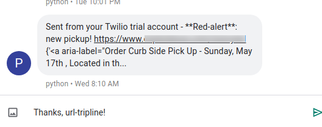

# url-tripline
Python webapp, to watch a URL &amp; send SMS alerts when a change is detected.

### Example

Web scraping tools are by nature very individualized. There are many like it, but this one is mine.

## Architecture
ARM (armhf / arm7+ 32bit)

The included prebuilt [selenium](https://github.com/SeleniumHQ/selenium) webdriver/ was built for armhf, which is great for running the project on low-cost 32bit ARM hardware like Raspberry Pi 4.

This project will *NOT* run out of the box on Intel/amd64 CPUs (See amd64 [App Engine](https://github.com/bjamesv/url-tripline/tree/gae-custom-runtime1/webdrivers) branch, or replace geckodriver with your own that matches your CPU arch).

## Docker
Dockerfile included to easily build & run application.

1) Edit configuration values:
    * `url.txt` - enter URL to watch
    * `config.py`
        * enter Twilio SMS id TWILIO_ACCOUNT_SID,
        * Twilio secret auth token TWILIO_AUTH_TOKEN,
        * sending US phone number US_TWILIO_NUMBER,
        * enter HTML class name JS_LOADED_STRING indicating when page is ready to search,
        * HTML HREF_CLASS_NAME identifying the page Anchor elements to watch,
        * US phone number ALERT_MOBILE_NUMBER to send SMS alerts
        * Customize CHANGE_MESSAGE_PREFIX as desired
2) Build: `docker build . -t url-tripline`
3) Run: `docker run -it -ePORT=8080 url-tripline`

Copyright (C) 2020 Brandon J. Van Vaerenbergh
